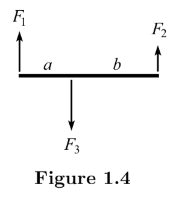
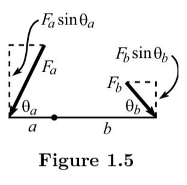

The first section will talk about Appendix B(Units, dimensional analysis), Appendix C(Approximations, limiting cases) and y

## Appendix B: Units, dimensional analysis

> There are two strategies you should invoke without hesitation when solving a problem. One is the consideration of units (that is, dimensions), which is the subject of this appendix (B). The other is the consideration of limiting cases, which is the subject of the next appendix (C).

In dimensional analysis, we can try different combinations of the given dimensional quantities to get the desired units. When doing so, sometimes we need to know whether a combination is the only choice for the desired unit, the book gave a checking method at *footnote 2* of *Example 1*.

The second example (spring example) is worth mentioning. In the description, the spring force is $F(x) = -kx$, where $k$ is the spring-constant and $x$ is the displacement from equilinrium. Based on this assumption, we can exploit dimensional analysis to find the only combination that can give us the unit $1/T$ for frequency. However, the book indicated that "a real spring doesn't have a perfectly parabolic potential (that is, an exactly linear force), so the force actually looks something like $F(x) = -kx + bx^2 + \cdots$." Then it talked about what will happen if we truncate the series at the second term and exploit dimensional analysis again.

## Appendix C: Approximations, limiting cases

The first thing worth mentioning is the choice of limiting cases. It makes no sense to *only* look at a quantity with dimension. Instead, we're supposed to look at "the limit of a small (or large) *dimensionless* quantity". In other words:

> We sometimes get sloppy and say things like, "In the limit of small $t$." But you know that we really mean, "In the limit of some small dimensionless quantity that has a $t$ in the numerator," or, "In the limit where $t$ is much smaller that a certain quantity that has the dimensions of time."

Example 1 served as a good example for the words above and Example 2 told us interesting limits might pop up when we are checking.

## Chapter 1: Statics

> A "static" situation is one where all the objects are motionless $\dots$ The whole goal in a statics problem is to find out what the various forces have to be so that there is zero net force acting on each object $\dots$ Since a force is a vector, this goal involves breaking the force up into its components $\dots$ Once you pick a system, you simply have to demand that the total force in each direction is zero.

### Balancing forces

There are four types of forces come up repeatedly:
* Tension
* Normal force
	* perpendicular to a surface
* Friction
	* parallel to the surface
	* kinetic friction between two objects is propotional to the normal force between them
* Gravity
	* $F = GMm/R^2$, $G = 6.67\times 10^{-11} m^3/(kg\cdot s^2)$
	* $F = m(\dfrac{GM}{R^2}) \equiv mg$, where $M$ and $R$ are the mass and radius of the earth

The "Rope wrapped around a pole" example showed us that in some cases, tension will vary with position.

### Balancing torques

*Claim 1.1*: For the system shown above, we have:

$$
F_3a = F_2(a+b)
$$

Actually, we also have:

$$
F_1a = F_2b \\
F_3b = F_1(a+b)
$$

Claim 1.1 indicated that torques cancel around any arbitrary pivot point.

When the forces are not perpendicular to the stick, like shown above, the claim applies to the components of the forces perpendicular to the stick. Thus, we have:

$$
F_a a \sin{\theta_a} = F_b b \sin{\theta_b}.
$$

The "Leaning ladder" example is a good practice for all the information above.