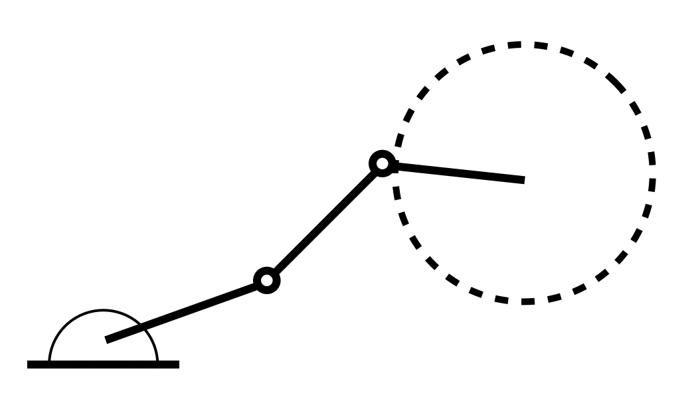

In the Exercise 5.3(e), we are asked to find all singularities of the a 4R planar mechanism. If we think about this problem without using Jacobian, the result is straightforward: The end-effector in the plane has 3 dof(one for rotation, two for translation). As long as some joint is working, the rotation freedom will be guaranteed. Then we will need two non-colinear links to generated two velocities which can be combined to get a velocity pointing to any direction in the plane. Thus, the singularities for this robot are when all the links form a straight line, in other words, $\theta_2$, $\theta_3$ and $\theta_4$ equal to $0^{\circ}$ or $180^{\circ}$. Will the Jacobian support our answer? 

For a set of given joint values $\theta = [\theta_1, \theta_2, \theta_3, \theta_4]$, we can get the space Jacobian analytically by treating the $i$-th column as the screw axis of joint $i$:

$$
\begin{aligned}
	J_s & = \begin{bmatrix} 1 & 1 & 1 & 1 \\ 0 & L_1\sin(\theta_1) & L_1\sin(\theta_1)+L_2\sin(\theta_1+\theta_2) & L_1\sin(\theta_1)+L_2\sin(\theta_1+\theta_2)+L_3\sin(\theta_1+\theta_2+\theta_3) \\
	0 & -L_1\cos(\theta_1) & -L_1\cos(\theta_1)-L_2\cos(\theta_1+\theta_2) & -L_1\cos(\theta_1)-L_2\cos(\theta_1+\theta_2)-L_3\cos(\theta_1+\theta_2+\theta_3) \end{bmatrix}
\end{aligned} 
$$ 

The maximum rank of this matrix is 3, and it's obvious that the first row is independent from the rest two. By obeservation, it's not hard to find that, when any two of $\theta_1$, $\theta_2$ and $\theta_3$ equal $0^{\circ}$ or $180^{\circ}$, no matter what values the other two joints have, the rank of the matrix will drop to 2. Thus, according to the Jacobian, we don't even need consider $\theta_4$ to reach singularities. \textbf{Furthermore, $\theta_4$ doesn't even show up in the Jacobian, does it have no affect to the end-effector velocity at all?} This problem may even make us doubt what's the meaning of $\mathcal{V}_s = J_s\dot{\theta}$, is this really the twist of the end-effector? Or it's actually the twist of the last joint? Since the last joint doesn't even show up! 

First, the last joint does show up when we calculating the twist from Jacobian. Remember the first equation that connects twist to Jacobian?

$$
\begin{aligned}
	\mathcal{V}_s = \underbrace{\mathcal{S}_1}_{J_{\mathcal{S}1}} \dot{\theta}_1 + \underbrace{Ad_{e^{[\mathcal{S}_1]\theta_1}}(\mathcal{S}_2)}_{J_{\mathcal{S}2}} \dot{\theta}_2 + \underbrace{Ad_{e^{[\mathcal{S}_1]\theta_1} e^{[\mathcal{S}_2]\theta_2}}(\mathcal{S}_3)}_{J_{\mathcal{S}3}} \dot{\theta}_3 + \underbrace{Ad_{e^{[\mathcal{S}_1]\theta_1} e^{[\mathcal{S}_2]\theta_2}e^{[\mathcal{S}_3]\theta_3}}(\mathcal{S}_4)}_{J_{\mathcal{S}4}} \dot{\theta}_4
\end{aligned} 
$$ 

In the equation above, the last joint shows up as $\mathcal{S}_4$ in $J_{\mathcal{S}4}$. Thus, when we are calculating the twist using Jacobian, it's the end-effector's twist, and the velocity of the last joint contributes to the final twist. However, when we are thinking about singularities, the value(not velocity) of the last joint doesn't really affect our results. As indicated by the equation above, there is no $$\theta_4$$ in $$J_{\mathcal{S}4}$$. 

Now, let's think about what's wrong with our first answer where $\theta_4$ is considered. First, we can start from a 2R planar mechanism. It has 2 dof, and it's natural to treat these 2 dof as two translational freedom, which means once the position of the end-effector is determined, the orientation is also determined. Thus, the Jacobian for this mechanism will have a maximum rank of 2. Once the two links are colinear, the rank will drop to 1. Then, for a 3R planar mechanism, it has 3 dof, which is enough to describe a rigid body in plane. To better understand this mechanism, let's look at the figure below: First, we determine the position of the end-effector. Since it can have any orientation in the plane, the other end of the third link can move in a circle. Then, all the first two links need to do, is to connect to the other end of the third link. Thus, once any two of the links are colinear, the mechanism will be a 2R robot, the orientation can not longer be chosen freely, the rank will drop and we will have a singularity. 

From the example above, we can see in our first answer, the statement "As long as some joint is working, the rotation freedom will be guaranteed" is wrong. The result from the Jacobian tells us, when any two of $\theta_1$, $\theta_2$ and $\theta_3$ equal $0^{\circ}$ or $180^{\circ}$, this 4R mechanism will become a 2R mechanism, thus we will have a singularity. The Jacobian is correct. 

Actually, when any two of $\theta_1$, $\theta_2$, $\theta_3$ and $\theta_4$ equal $0^{\circ}$ or $180^{\circ}$, there will be a singularity. Since $\theta_4$ doesn't show up in our $J_s$, we can not get a comprehensive singularity analysis just based on space Jacobian. In the body Jacobian, however, $\theta_4$ will be included but $\theta_1$ will be ignored. In conclusion, even though the body and space Jacobians have same rank, we still need to look at both of them to get all possible singularities.